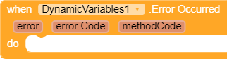
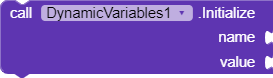
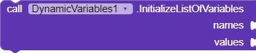
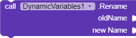
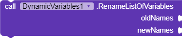

# DynamicVariable-Kodular-AI2-Extension
Simple extension for adding dynamic variables in AI2 and its disturbution.

# Blocks

<table style = "width:100%">
	<tr>
		<th width = "35%">Blocks</th>
		<th width = "60%">Description</th>
		<th width = "5%">Method Code</th>
	</tr>
	<tr>
		<td>
			
		</td>
		<td>Raises when any error occured. All errors explained in <a href="https://github.com/WaterMelonOof/DynamicVariables-Kodular-AI2-Extension/blob/master/README.md#errors">Errors</a>.   
		<table>
			<tr>
				<th>Params</th>
				<th>Type</th>
			</tr>
			<tr>
				<td>error</td>
				<td>String</td>
			</tr>
			<tr>
				<td>errorCode</td>
				<td>int</td>
			</tr>
			<tr>
				<td>methodCode</td>
				<td>int</td>
			<tr>
			</table>
		</td>
		<td align = "center">N/A</td>
	</tr>
	<tr>
		<td>
			
		</td>
		<td>Initialize/Change a variable. "name" and "value" can be anything but not nothing.   
		<table>
			<tr>
				<th>Params</th>
				<th>Type</th>
			</tr>
			<tr>
				<td>name</td>
				<td>Any</td>
			</tr>
			<tr>
				<td>value</td>
				<td>Any</td>
			</tr>
			</table>
		</td>
		<td align = "center">0</td>
	</tr>
	<tr>
		<td>
			
		</td>
		<td>Initialize/Change list of variables. Both list mustn't be empty. "names" and "values" must a list, and their length must be the same. Variable(s) is/are initialize/change in assending way.  
		<table>
			<tr>
				<th>Params</th>
				<th>Type</th>
			</tr>
			<tr>
				<td>names</td>
				<td>List</td>
			</tr>
			<tr>
				<td>values</td>
				<td>List</td>
			</tr>
			</table>
		</td>
		<td align = "center">1</td>
	</tr>
	<tr>
		<td>
			
		</td>
		<td><b>Returns: <i>Any</i></b> Get value of a variable. If the variable isn't exist, return "not found".  
		<table>
			<tr>
				<th>Params</th>
				<th>Type</th>
			</tr>
			<tr>
				<td>name</td>
				<td>Any</td>
			</tr>
			</table>
		</td>
		<td align = "center">2</td>
	</tr>
	<tr>
		<td>
			
		</td>
		<td><b>Returns: <i>List</i></b> Get list of values. Input should be a list of variable's name. Output will a list of values in the order of input list. If any of the names isn't exist, that item will be "not found". If the input list is empty, or any error occurred, return an empty list.  
		<table>
			<tr>
				<th>Params</th>
				<th>Type</th>
			</tr>
			<tr>
				<td>names</td>
				<td>List</td>
			</tr>
			</table>
		</td>
		<td align = "center">3</td>
	</tr>
	<tr>
		<td>
			
		</td>
		<td><b>Returns: <i>List</i></b> Get all variable's names. Return an empty list if there's no variable, or when error occured.</td>
		<td align = "center">4</td>
	</tr>
	<tr>
		<td>
			
		</td>
		<td><b>Returns: <i>List</i></b> Get all values. Return an empty list if there's no variable, or when error occurred.</td>
		<td align = "center">5</td>
	</tr>
	<tr>
		<td>
			
		</td>
		<td>Rename a variable. If the old variable doesn't exist, error will occur.  
		<table>
			<tr>
				<th>Params</th>
				<th>Type</th>
			</tr>
			<tr>
				<td>oldName</td>
				<td>Any</td>
			</tr>
			<tr>
				<td>newName</td>
				<td>Any</td>
			</tr>
		</table>
		</td>
		<td align = "center">6</td>
	</tr>
	<tr>
		<td>
			
		</td>
		<td>Rename a list of varibles. All list must not be empty. Length of both list must be the same. This method will rename variable(s) in assending order. If any one of the oldName doesn't exist, error will occur, but the oldNames before the error occurred will be renamed.  
		<table>
			<tr>
				<th>Params</th>
				<th>Type</th>
			</tr>
			<tr>
				<td>oldNames</td>
				<td>List</td>
			</tr>
			<tr>
				<td>newNames</td>
				<td>List</td>
			</tr>
		</table>
		</td>
		<td align = "center">7</td>
	</tr>
	<tr>
		<td>
			
		</td>
		<td><b>Returns: <i>Any</i></b> Remove a variable. Return removed value. If variable's name doesn't exist, error will occur and return an empty string.  
		<table>
			<tr>
				<th>Params</th>
				<th>Type</th>
			</tr>
			<tr>
				<td>name</td>
				<td>Any</td>
			</tr>
			</table>
		</td>
		<td align = "center">8</td>
	</tr>
	<tr>
		<td>
			
		</td>
		<td><b>Returns: <i>List</i></b> Remove list of variables. Return a list of removed values. If any of variable's name doesn't exist, error will occur and return list of values that removed before the error occurred.  
		<table>
			<tr>
				<th>Params</th>
				<th>Type</th>
			</tr>
			<tr>
				<td>names</td>
				<td>List</td>
			</tr>
			</table>
		</td>
		<td align = "center">9</td>
	</tr>
	<tr>
		<td>
			
		</td>
		<td>Remove all variables. If there's no variable exist, nothing will happen.</td>
		<td align = "center">10</td>
	</tr>
	<tr>
		<td>
			
		</td>
		<td><b>Returns: <i>Boolean</i></b> Check if specific variable name exist. Return true of variable exists, otherwise false. Return false if error occurred.  
		<table>
			<tr>
				<th>Params</th>
				<th>Type</th>
			</tr>
			<tr>
				<td>name</td>
				<td>Any</td>
			</tr>
			</table>
		</td>
		<td align = "center">11</td>
	</tr>
	<tr>
		<td>
			
		</td>
		<td><b>Returns: <i>Number (int)</i></b> Return the number of variables. Return -1 if error occurred.</td>
		<td align = "center">12</td>
	</tr>
	<tr>
		<td>
			
		</td>
		<td><b>Returns: <i>Boolean</i></b> Check if any variables exist. Return true if no variable exists, otherwise false. If error occurred, return false.</td>
		<td align = "center">13</td>
	</tr>
		</table>
	
# Errors

<table>
	<tr>
		<th>Error Code</th>
		<th>Error</th>
	</tr>
	<tr>
		<td>0</td>
		<td>Exception error</td>
	</tr>
	<tr>
		<td>1</td>
		<td>List cannot be empty</td>
	</tr>
	<tr>
		<td>2</td>
		<td>Length of both list must be same</td>
	</tr>
	<tr>
		<td>3</td>
		<td>Old variable doesn't exist</td>
	</tr>
</table>
	
# Change Log
<small><i>No change log yet ;)</i></small>

# Build Extensions

# Reference
